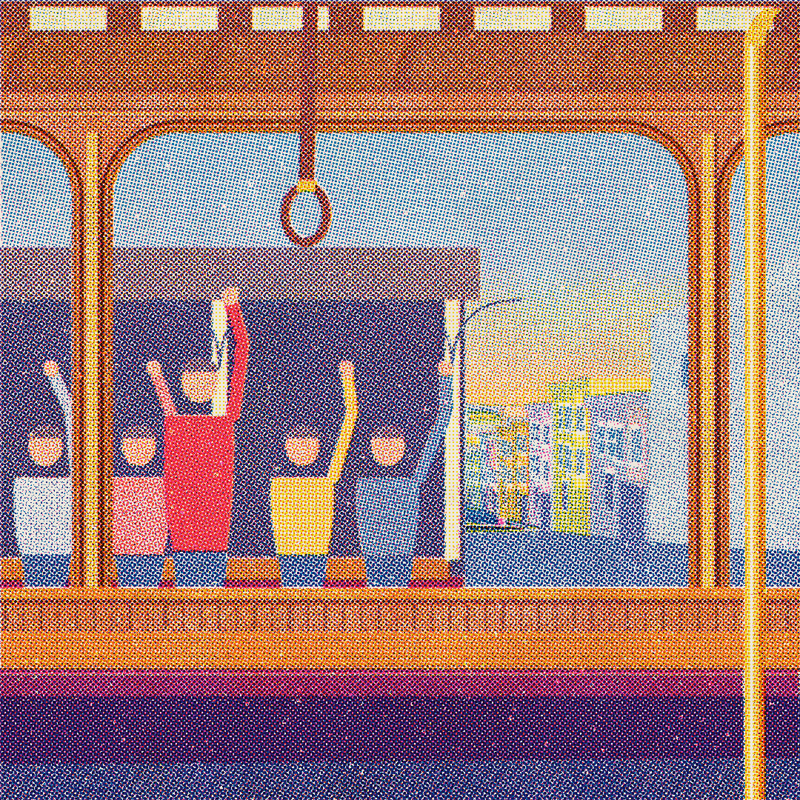
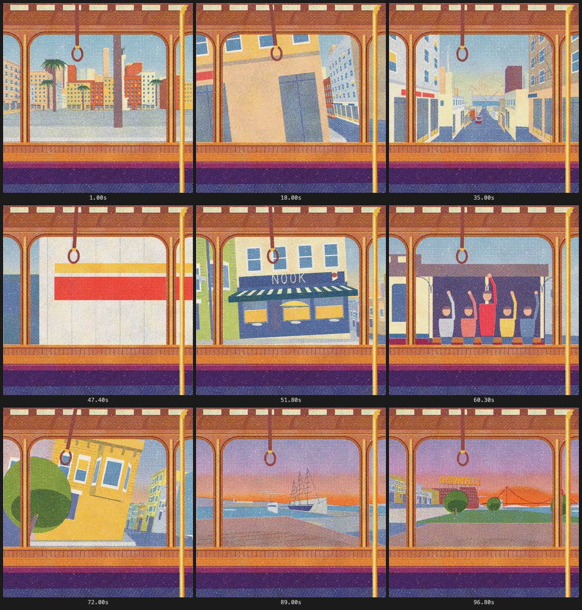

# A Journey on the Powell-Hyde Cable Car

A 97-second procedural risograph film of a ride on San Francisco's Powell–Hyde cable car, from
Union Square over Nob Hill and Russian Hill down to the bay, seen through one window of a Powell
car. Every pixel is drawn in Canvas 2D and every sound but one is synthesised, in a single
`index.html` with no libraries, fonts, images or network calls.



**Watch:** open [`site/`](site/) (deployed on Vercel), or open
[`films/hyde-street/index.html`](films/hyde-street/) in a browser and press Play, with Sound on.

**Play:** [`/game`](site/game/) walks a coyote over the same hills, from Union Square to the
bay, in the same risograph print. ← → walk, ↑ jump, ↓ duck (on-screen buttons on phones).

## Hyde Street

The camera is bolted to the car. When it climbs Powell (up to 17%) or plunges down Hyde (21%, the
steepest grade in the system), the street stays parallel to the sill and the whole city tilts;
the leather strap hangs plumb and swings at every start and stop.

| Time | Passage |
|---|---|
| 0–30 s | Union Square and the Dewey column, then the climb up Powell past hotels and neon blade signs |
| 30–39 s | The level crossing at California Street: down the canyon to the Bay Bridge, a California car climbing |
| 39–55 s | A truck overtakes and covers the turn through Jackson; Nook on the corner; Russian Hill Victorians |
| 55–65 s | Stopped at Lombard: the crooked street below, Coit Tower at the end, a southbound car passes with riders waving |
| 65–83 s | The 21% plunge toward the bay as the sun goes down |
| 83–97 s | The turntable at Hyde & Beach swings the window past the wharf, a tall ship, Alcatraz and the Golden Gate; the Ghirardelli sign comes on |

The sound is the ride: a grinding roar modelled on a field recording of a Powell car, wheels
knocking over rail joints, the grip, the brakes, the gripman's bell, gulls (a public-domain
National Park Service recording) and a foghorn. Design notes, measurements and known weaknesses
are in [`films/hyde-street/FILM.md`](films/hyde-street/FILM.md); audio credits in
[`AUDIO-SOURCES.md`](films/hyde-street/AUDIO-SOURCES.md).



## The kit it was made with

This repo is built on [riso-windowseat](https://github.com/sevenevesai/riso-windowseat), the
release of **Window Seat** together with the Claude Code skills, craft docs and render harness
its films grew. Hyde Street was made with that kit; the original films are kept below.

## The kit's films

All are 1080 × 1080, 30 fps. MP4s are on the
[v1.0 release](https://github.com/sevenevesai/riso-windowseat/releases/tag/v1.0). To watch the
source instead, open any `index.html` in a browser and press play.

| Film | Length | |
|---|---|---|
| [Hyde Street](films/hyde-street/) | 97 s | A Powell–Hyde cable car ride from Union Square to the bay, through one window |
| [Window Seat](films/window-seat/) | 78 s | A night train journey through one window, scored for piano |
| [Roost](films/roost/) | 70 s | One take of a starling murmuration from sunset to roost, scored for strings |
| [Lumen](films/lumen/) | 28 s | A seed that contains a sun; the first short, in call-and-response form |
| [Emergence](films/emergence/) | 28 s | Lumen's sibling: how machines learned to listen, as nine worlds |

### Window Seat

A night train journey seen through one fixed window with a glass of water on the sill. Every
pixel and every sound except the piano is procedural.

| Time | Passage |
|---|---|
| 0–19 s | Golden departure from a platform, fields, a red truss bridge, a conifer cutting, a tunnel |
| 19–38 s | A night city with a canal and a level crossing; another train overtakes, passengers in its windows |
| 38–57 s | Fireworks over a lake, sleeper hours with star trails, pre-dawn fog |
| 57–78 s | Dawn from a viaduct, rain streaming back along the glass, a lakeside halt under a rainbow |

The score, "A Light Left in the Window", is an original piano piece in 6/8 whose phrasing follows
the picture's timeline. The glass of water leans with every acceleration and is the last thing to
settle.


### Roost

A murmuration over a marsh in one fixed view. Each starling is a 2–3 px ink dot, so the flock
is the halftone: where the sheet turns edge-on, the birds pile into dark printed ribbons. A
falcon stoops through it and the flock pours into the reeds at nightfall. The string score is
timed from the picture.

## How they're made

I directed each film; Claude Code (Anthropic's coding agent) wrote the code, using the skills,
rules and docs in this repo. A work is designed in its `FILM.md`, its hardest frame is proved
first, and then it is inspected as frame strips, 1:1 crops and loudness sheets rendered by
`tools/`. Every frame is a pure function of time (`seek(t)`), so any moment can be inspected
exactly and the MP4 cannot drop frames. Each `FILM.md` records the design decisions and
measurements, and lists the film's remaining weaknesses.

## Make your own

```
git clone https://github.com/akdeb/sf-cable-car-ride
cd sf-cable-car-ride/tools
npm install && npm run setup && npm test
```

Then open Claude Code in the repo root and ask, for example:

- "Make a 40 second riso film of a lighthouse keeper's night."
- "Make a riso poster of a heron on a pier at dusk."
- "Score this film" or "The rain at 66 s is too loud."
- "Extend Window Seat with a snowy mountain pass after the lake."

`CLAUDE.md` gives the session the contract and commands. The `riso-film`, `riso-still` and
`riso-score` skills in `.claude/skills/` carry the workflow and gates. Each skill's `examples.md`
points to the routines in the shipped films that are worth reusing. A hook warns when an edit
breaks determinism.

## What's inside

| Path | Contents |
|---|---|
| `films/` | The four films, each with its `FILM.md`; Window Seat and Roost include sample credits and bank rebuild scripts |
| `prints/workings/` | A still print series and the print kit new works start from |
| `docs/` | The craft: brief, visual development, drawing, scene space, motion, sound, quality bar |
| `studies/` | Interactive A/B studies of each technique, and the sound kit |
| `tools/` | Scaffolding, verification, contact sheets, audio analysis and MP4 export ([README](tools/README.md)) |
| `.claude/` | Skills, the ink-plate rule and the determinism hook |

## License

MIT, see [LICENSE](LICENSE). The piano recordings embedded in Window Seat are Salamander Grand
Piano V3 by Alexander Holm under CC BY 3.0; see
[`AUDIO-SOURCES.md`](films/window-seat/AUDIO-SOURCES.md). The string recordings embedded in
Roost are VSCO 2 Community Edition by Versilian Studios under CC0 1.0; see
[`AUDIO-SOURCES.md`](films/roost/AUDIO-SOURCES.md).
